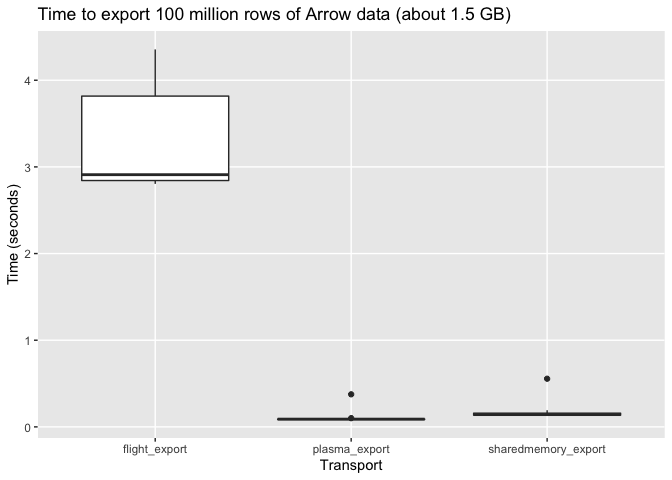
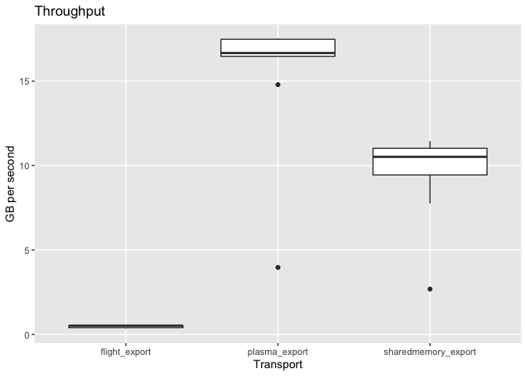
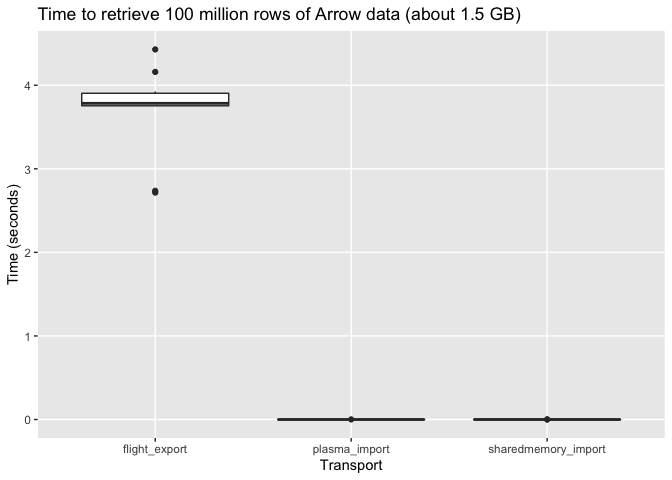

Sharing Arrow data between processes
================

These are some tests to compare different methods of sharing an Arrow
table between different processes.





    # A tibble: 4 × 5
      name                avg_time_sec min_time_sec avg_gbps max_gbps
      <chr>                      <dbl>        <dbl>    <dbl>    <dbl>
    1 flight_tcp_export          0.394       0.300     4.31     4.97 
    2 flight_unix_export         2.69        2.56      0.556    0.582
    3 plasma_export              0.120       0.0827   14.5     18.0  
    4 sharedmemory_export        0.254       0.127     8.74    11.7  



    # A tibble: 4 × 3
      name                avg_time_sec min_time_sec
      <chr>                      <dbl>        <dbl>
    1 flight_tcp_import          0.427       0.383 
    2 flight_unix_import         2.54        2.42  
    3 plasma_import              0.432       0.0447
    4 sharedmemory_import        0.212       0.193 

## How to run

First start the plasma server

``` shell
plasma_store -m 1000000000 -s /tmp/plasma
```

Then, start the flight servers

``` shell
python flight_server.py
```

``` shell
python flight_server.py --use-tcp
```

Then run the share benchmarks:

``` shell
python share_arrow.py
```

Finally, run the retrieve benchmarks:
